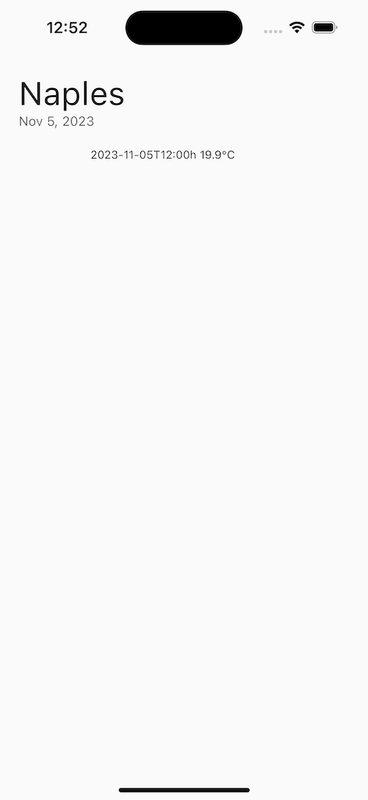

# Weather App

A Flutter application that retrieves current temperature based on device location and time, utilizing [Open Meteo API](https://open-meteo.com/). State management is handled with [GetX](https://pub.dev/packages/get) for efficient and reactive state handling.

## Overview

This mobile app allows users to get real-time temperature information based on their current location and time. It uses the Open Meteo API to provide accurate weather data.

## Features

- Retrieve temperature data based on device location and time.
- Efficient state management with GetX.

## Getting Started

1. Clone the repository.
2. Install dependencies using flutter pub get.
3. Run the app with flutter run.

## Dependencies

- [GetX](https://pub.dev/packages/get)
- [http](https://pub.dev/packages/http) - for API calls.

## Usage

1. Launch the app on your device or simulator.
2. Grant location access when prompted.
3. The app will fetch and display the current temperature.

## State Management with GetX

This project utilizes the GetX package for efficient state management. Be sure to check out the [GetX documentation](https://pub.dev/packages/get) for more details.

## Screenshots

## Contributing

If you'd like to contribute to this project, feel free to fork the repository and submit a pull request!

## License

This project is licensed under the [MIT License](LICENSE).
